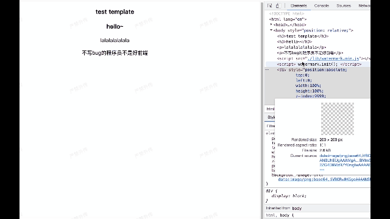

## 概要

一款适用于web页面的水印SDK
Add watermark on Web page

## 特点
* 简单易用，适用于多种项目框架
* 可自定义水印文本，颜色，大小，以及位置
* 监控 DOM 变化，实现水印不可删除
* ...




## 使用

### 1. 通过`script`标签引入

#### 安装

`npm install watermark-h5 --save-d`

#### 使用

```js
// 注意：js需要放body最下面引入，防止初始化失败
<script src="./watermark.min.js"></script>
// 会将对象watermark挂载到全局window对象上

<script>
    watermark.init();
</script>

```


### 2. 通过`npm`安装

#### 安装

`npm install watermark-h5 --save`

#### 使用

```js
import watermark from 'watermark-h5'

watermark.init()
```

### 3. 自定义水印

`init()`函数支持以下参数：

```js

  parentDomName: string, // 父节点dom选择器名字
  show: boolean, // 水印开关
  color: string, // 水印色值
  title: string, // 显示的水印文本
  width: number, // 水印宽高
  height: number,
  fontNum: number, // 水印字体大小
  rotate: number, // 旋转角度
  zIndex: number, 

// 默认值

defaultConfig = {
    parentDomName: 'body',
    show: true,
    color: 'rgba(0, 0, 0, 0.06)',
    title: '严禁外传',
    width: 200,
    height: 200,
    fontNum: 15,
    rotate: -25,
    zIndex: 9999
}
```

#### 4. 删除水印

`watermark.clear()`


#### 5. 展示水印

`watermark.show()`


### vue3 + vite + ts 项目中使用

可能会有报错：`Could not find a declaration file for module 'watermark-h5'. `

需要声明一下类型:


